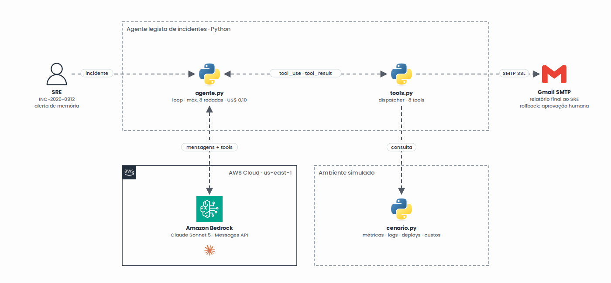

<h1 align="center">Agente de incidentes com análise temporal</h1>

<p align="center">
  Agente de IA que investiga incidentes de cloud e prevê quando um recurso vai esgotar
</p>

<p align="center"></p>

<p align="center">
  
  
  
  
</p>

## Sobre

Checkpoint individual da FIAP. Evolui o agente minimalista do professor com a tool `analisar_serie_temporal`, um cenário de memory leak no `checkout-api`, o port da OpenAI para o Claude Sonnet 5 no AWS Bedrock e o envio do relatório por e-mail.

## Como rodar

```bash
python3 -m venv .venv && .venv/bin/pip install "anthropic[bedrock]" python-dotenv
cp .env.example .env
.venv/bin/python agente.py
```

Requer o profile do AWS CLI definido em `agente.py`, com acesso ao Bedrock, e a senha de app do Gmail no `.env`.
